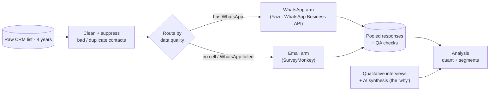
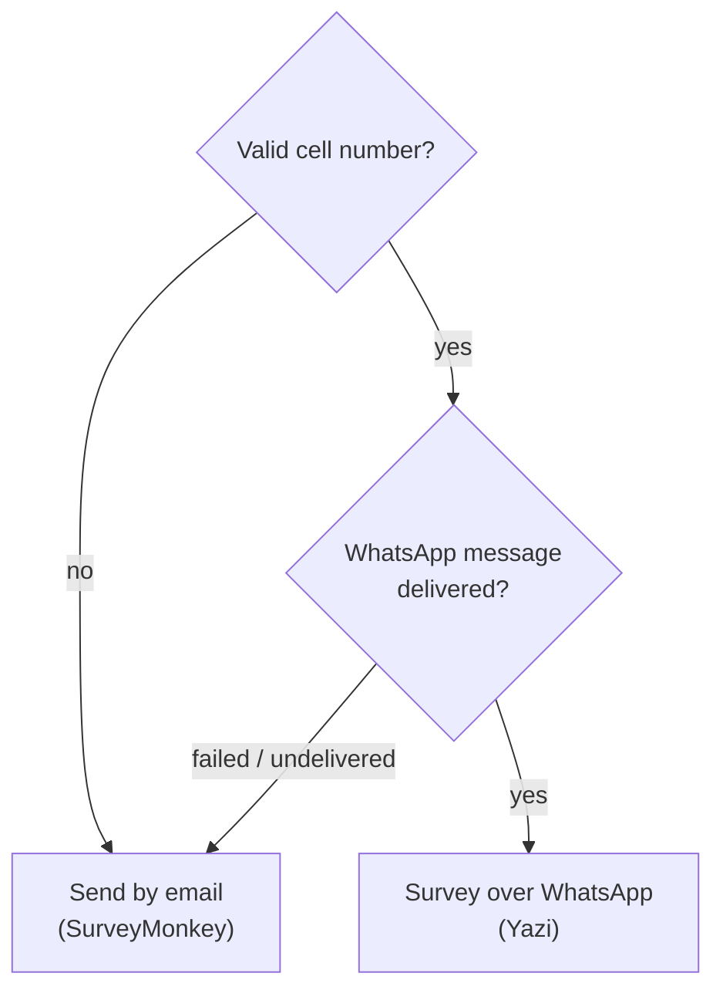

# Customer research & competitive intelligence at national scale ✦ a product case study

This is a portfolio piece walking through a project I led end to end: a deep customer
research and competitive intelligence programme that reached national scale over WhatsApp,
used AI to compress qualitative synthesis, and left behind a measurement instrument the
business now runs on. The goal wasn't a soft "how's the brand doing" read. It was
decision-grade evidence on what drives customer choice, where we lose them to competitors,
and why.

I'm writing it the way I write a decision doc for engineering: problem first, then the
calls I made and why, then the trade-offs I accepted. Where I made a prioritisation call under incomplete data, I've said so
and shown the commercial logic, because that's the part of product work that actually
compounds.

> **What I led.** I owned this end to end: research strategy, survey design, the tooling and
> implementation, the qualitative interviews and thematic analysis, and the quantitative
> analysis in Python — working with one co-researcher who supported survey design and quant. A
> two-person team. I name the real tools (Yazi for WhatsApp, SurveyMonkey for email) because
> the method is the transferable part. CRM means the customer database the sales team works
> from.

## The problem: high-stakes calls with no clean way to answer them

The business was making brand, retention, and competitive calls on gut — which agencies
customers actually consider, why they pick one over another, and where we lose them. The
mandate was to replace instinct with evidence solid enough to bet strategy on: deep customer
research on the decision journey, plus competitive intelligence on who we really compete with.

Two things stood between the questions and the answers, and both are the operational kind of
problem where the work is actually won.

The first was the data. Four years of listings had left the CRM full of holes: false
addresses, made-up numbers, agents entering their own contact details instead of the
client's. The second was the channel. Email open rates in this market are low, so an
email-only survey returns a sample too small and too skewed to make a national claim from.

| The instinct | What it costs | The call I made |
|---|---|---|
| Survey the raw CRM list | Pay to message thousands of dead contacts | Clean and suppress bad records before sending |
| Default to email | ~1.7% completion, a sample you can't trust | WhatsApp first; email only for the gaps |
| One big blast to everyone | Duplicate entries, no visibility into drop-off | One contact, one channel, with read receipts |

## The system: discovery to decision, end to end

I ran it as a pipeline with separable stages, so a problem in one never corrupted
the next. Clean the contacts, route each person to a single channel, collect on two
platforms, quality-check, then analyse and layer interviews on top.

> **Diagram ✦ the path from a raw list to a decision.** A cleaned contact list splits by
> data quality into a WhatsApp arm and an email arm. Both feed one pooled, quality-checked
> dataset. Qualitative interviews run alongside to explain what the numbers mean.

WhatsApp delivery ran through Yazi, a vendor that sends surveys over the WhatsApp Business
API — Meta's official channel for businesses to message customers — and opens a small in-chat
app so people can answer fast. Email ran through SurveyMonkey. The analysis sits behind both
and doesn't care which channel a response came from.

## Prioritisation calls under uncertainty

Every decision below was made before fielding, on incomplete data, and defended with
commercial logic rather than consensus. That's deliberate: decisions made before the work
starts are what keep delivery clean.

### Bet on WhatsApp; use email only for the gaps

The biggest call was the channel. I made WhatsApp the default and email the fallback for
contacts with no cell number or a failed WhatsApp delivery. You'd expect email to be the
safe default. The response gap below shows why that instinct is wrong for this audience.

### Route each contact to one channel, never both

Every contact went to exactly one channel. Sending the same person both surveys would
double-count them and quietly corrupt the dataset — the kind of edge case that doesn't show
up until you're trying to defend a number to the board.

> **Diagram ✦ choosing a channel.** Work down the checks and stop at the first that fits.

### Clean before you send, so you don't pay for bounces

We spent over a week cleaning the list before a single survey went out, using the
agents' own records to suppress contacts already known to be wrong. One cleaning pass up
front is cheaper than thousands of failed sends, and it protects the sample from the bias a
bounce-heavy list introduces. Cost per usable response is a gross-profit decision, so I
treated it like one.

### Size the sample for confidence, not for vanity

A bigger sample sounds better. Past a point it isn't, and spending past that point is waste.
Margin of error is the band around a result within which the true figure most likely sits. A
sample near 400 gives a 95% confidence level at about ±5%; at 1,000 that tightens to roughly
±3%; beyond that the gains shrink fast.

| Study type | Typical sample | What it buys |
|---|---|---|
| Small consumer pilot | 100–200 | Directional trends only |
| Professional brand tracking | 400–600 | The industry average |
| National election polling | 1,000–1,200 | Gold standard for national representation |
| This project | ~2,100 | High-confidence, national-level scale |

I set ~2,000 as the deliberate ceiling. Moving from 1,000 to 2,000 adds a small precision
gain; past that it buys almost nothing for a lot more cost.

## WhatsApp vs email: the response-rate gap

This is the result the whole channel strategy turned on. Run as two funnels side by side, the
seller survey reached 1,212 clean responses — "clean" meaning it passed the QA checks below.

| Seller survey | Contacts sent | Started | Completed + clean |
|---|---|---|---|
| WhatsApp (Yazi) | 10,667 | 1,562 (15%) | 1,050 (**10%**) |
| Email (SurveyMonkey) | 9,817 | 248 (2.5%) | 162 (**1.7%**) |

WhatsApp completed at roughly six times the rate of email off a similar-sized send. The
prospective-seller survey added the nuance: there both channels landed near 3%, so WhatsApp's
edge is largest with people who already have a relationship with the brand — a finding that
shapes which audiences are worth which channel.

Three things made it work:

- **it meets people where they are:** the survey arrives in the app South Africans already
  check, not in an inbox they ignore
- **it's fast to answer:** the in-chat app makes responding feel like a quick reply, not a
  form to sit down with
- **you can see the drop-off:** read receipts showed 66% of WhatsApp recipients opened the
  message, so I could watch where people fell out and adjust the next batch

That last point is the operational payoff: WhatsApp gave me a feedback loop on the research
itself, which is how I learned recent contacts answered far better and re-targeted later
batches at them.

## Analysis: Python for the quant, AI for the qual

Analysis ran in two halves, and I led both. The quantitative side — the response funnels, the
segment cross-tabs by age and province, the NPS and value-for-money breakdowns — I built in
Python, with my co-researcher supporting parts of it. That gives you the *what* at scale.

The harder half is the *why*, and it's where I leaned on AI. Open-text answers and the
interviews I ran tell you why people choose what they choose — but only if you can read them
at scale before the insight goes stale. Across the two surveys there were hundreds of
free-text responses, plus 30-minute seller interviews. By hand, that's a multi-week synthesis
job. I used AI to compress it.

The qualitative workflow ran in three passes: classify sentiment on every open-text response,
cluster responses into recurring themes with mention counts, then synthesise the interview
transcripts into the same theme framework so qualitative depth and quantitative weight lined
up. A wall of comments became a ranked, countable, prioritisable signal.

The payoff was concrete. The single biggest driver of seller choice in the survey was "I
trusted and liked the agent" (62%) — true but not actionable on its own. The synthesis broke
that into six behaviours you can actually train and measure: professionalism, rapport,
responsiveness, reassurance, long-term relationship, and honesty. And on the loss side, it
surfaced that "no follow-up" was the largest dissatisfaction theme by a wide margin (around
80 mentions) — a specific, fixable, trackable failure rather than a vague complaint.

That is the loop I'd bring to a product roadmap: hundreds of raw interactions in, a small set
of prioritisable, measurable drivers out, fast enough to act on while it's still warm.

## Edge cases and exceptions: where the data was won

A response only counts if it's real and complete, and no shortcut is allowed to quietly
inflate the numbers. Operational research, like operational software, is won in the
exceptions.

- **QA on every response:** drop any survey finished in under two minutes, drop any that
  didn't complete the final question, and drop any where two answers logically contradicted
  each other (commission satisfaction versus likelihood to recommend)
- **de-dup before claiming conversion:** actual Rawson sellers were removed from the
  prospective list first, so the prospective figures don't double-count real sellers and
  aren't misread as a clean valuation-to-listing conversion rate
- **the arm I killed:** a third "cold audience" arm — sellers reached with no warm contact
  data — returned 49 responses, so I cut it rather than keep spending; with no relationship
  and no clean number, neither channel performs

After QA, the study landed at 1,212 seller and 885 prospective-seller responses — roughly
2,100 clean records, enough for the national-level confidence the strategy needed.

## What the insight unlocked

I'll keep findings to the ones that changed how the business thinks, since the method is the
point of this piece.

- **a retention lever, named:** among prospective sellers who went to a competitor, the top
  reason was more responsive communication, and 82% of those dissatisfied with their
  valuation said the agent never followed up — turning a fuzzy "service" worry into a
  specific, measurable follow-up gap to fix
- **brand strength, quantified:** 76% of sellers listed exclusively with Rawson, 81% felt the
  commission was fair, and Rawson rated "much better" than rivals on professionalism (76%) and
  on transparency and communication (73%)
- **one real challenger:** Rawson topped unaided awareness at 76%, and of all competitors only
  RE/MAX paired high awareness with a high rate of converting it into serious consideration —
  so competitive attention has one clear address

The throughline across both audiences, confirmed by the AI synthesis, is the same: agent
behaviour — especially responsiveness and follow-up — drives who wins the listing and who
recommends the brand afterwards. That's an activation-and-retention insight, not a brand-vanity
one.

## Decided against: the calls I didn't make

The decisions I'm most deliberate about are the ones I chose *not* to take:

- **a cold general-audience arm:** tried, returned 49 responses, cut — without warm contact
  data neither channel performs, so the spend wasn't justified
- **email-first:** rejected once the funnels were in; 1.7% against 10% isn't a close call
- **a census-scale sample:** deferred — past roughly 1,000 to 2,000 responses the extra
  precision doesn't pay, so chasing 3,000+ was left to government-scale studies

The pattern is the one I apply to a roadmap: optimise for confidence per rand spent, not for
the biggest raw number.

## Continuous insight, not a quarterly event

The real deliverable wasn't a deck. It was a repeatable instrument.

- **done:** both surveys fielded and cleaned, both datasets analysed, the first interviews in
  and synthesised
- **next:** finish the remaining interviews to deepen the "why" behind the numbers
- **the point:** a small, fixed set of metrics — NPS (Net Promoter Score, the share of
  customers rating you 9–10 on likelihood to recommend, minus the 0–6 detractors),
  exclusive-listing rate, top-of-mind awareness, and "much better" perception — re-fielded on
  the same WhatsApp-first pipeline, so shifts show up as a trend rather than a one-off snapshot

A brand claim measured once is a snapshot. The same instrument re-run on a cadence is a
signal that feeds strategy in near real time — which is the version of customer insight I'd
want feeding a product roadmap.

*Owner: Jess Klette · Role: research lead (two-person team) · Last reviewed: 2026-06-25. The
underlying response data and full board deck live separately.*
